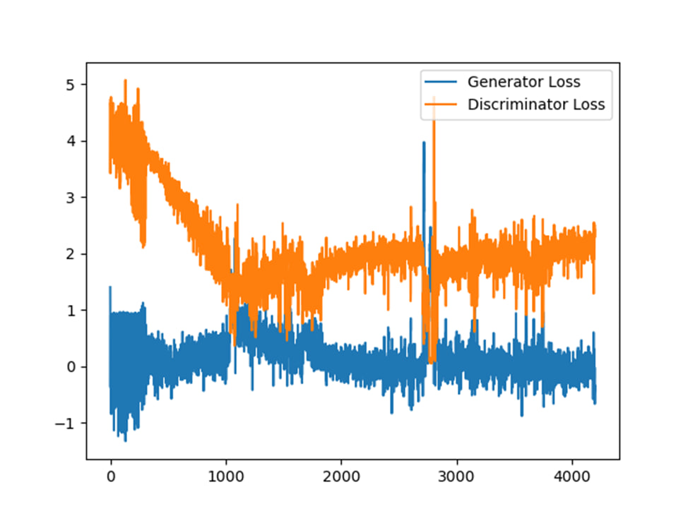
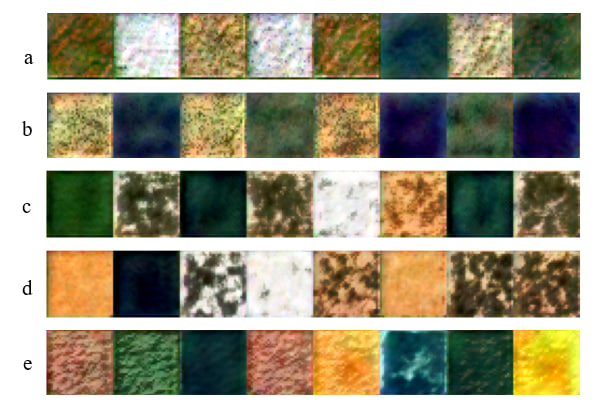
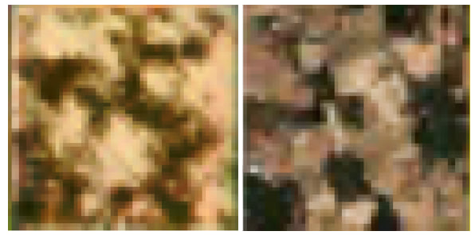

# $`\mu`$StyleGAN

A simplified version of StyleGAN/StyleGAN 2. The main purpose is to implement a smaller version of the GAN for forum presentation. 

# The main differences:
- The network generates 32 $\times$ 32 px instead of 1024 $\times$ 1024 px.
- Smaller architecture: mapping network (5 layers used instead of 8 in original), generator and discriminator ($\log_2(32) = 5$ blocks instead of $\log_2(1024) = 10$)
- Noise injection was performed in two steps:
   - 1. Generate the base noise before mapping styles.
   - 2. In each style block add randomly generated noise instead of using pregenerated outter.
 - Default interpolation method is `nearest-exact` instead of `bilinear` so produced images are more smooth.

# Results

## Loss

||
|:--:|
|Image 1 - Generator and discriminator train losses per epochs|

## Generated samples

|  |
| :--: |
| Image 2 - training results per epochs: 1200 epochs (a), 1500(b), 3200(c), 3500(c), 4200(e)|

## Generated and original images comparison

||
|:--:|
|Image 3 - Comparison of zoomed generated (left) and real (right) images|
